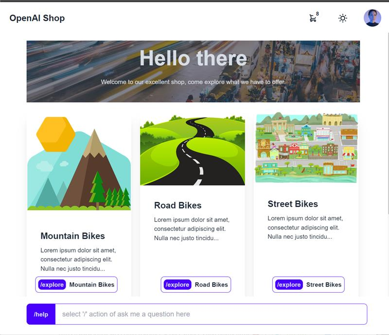
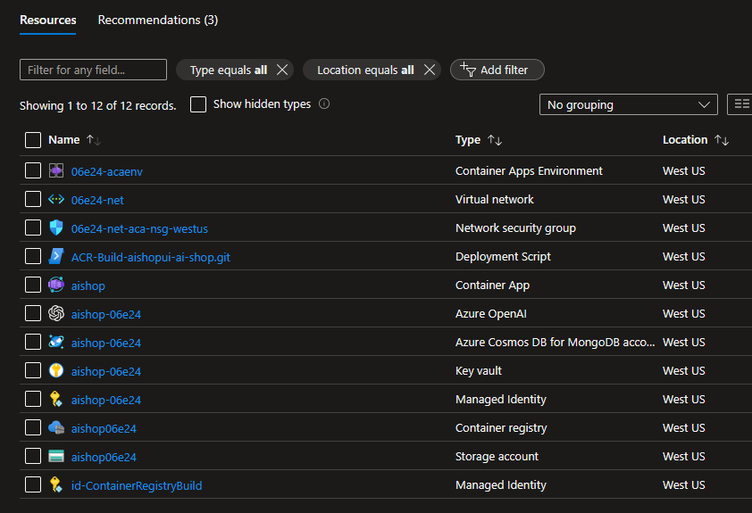

# Retail Store with AI

This project is intended to be a north-star to design, build and deploy webapps combining the power of both regular programming logic and GPU based LLMs, giving the user an enhanced natural, feed-based UX that is instantly familiar, allowing users to interact with all the services of your business intuitively.

The principles this repo upholds are:

 :heavy_check_mark:  Targeting cloud agnostic dependencies where practical, open-source, open-protocols  
 :heavy_check_mark:  Easily run the whole app on a dev laptop with local dependencies where possible (ex. OpenAI)
 :heavy_check_mark:  Independent and loosely coupled services, with boundaries based on team & data  
 :heavy_check_mark:  Performance, Security, Reliability and Cost are 1st class considerations  
 :heavy_check_mark:  Automated testing & deployments, for PR confidence & blue-green workflows  




The intended scope of this project will include:
 * `/app/shop` the storefront (available today)
 * `/app/factory` factory to create inventory (future)
 * `/app/order` the order processor (future)


## To quicky run the app in your Azure Subscription

The project's `setup` directory contains a simple script & IaC (Infra-as-Code) to bootstrap the demo into your Azure subscription.  The IaC files provisions all the resources you need to run the project, builds the initial container using [Azure Container Registry Tasks](https://learn.microsoft.com/azure/container-registry/container-registry-tasks-overview), and deploys to [Azure Container Apps](https://learn.microsoft.com/azure/container-apps/overview).

The easiest way to deploy is using the *Azure Cloud shell*, as this has the Azure CLI already installed & logged in.

* **Step 1** : goto [Azure Cloud Shell](https://shell.azure.com), and once you have a `$` prompt,

* **Step 2** : Run the following to deploy. 

    >NOTE: Change `westeurope` to the region of your choice
   ```sh
   # Change to project directory
   cd ai-shop

   # Set region and a unique name for the deployment
   location="westeurope"
   uniqueName=$(printf '%05x' $RANDOM)
   rgName="aishop-${uniqueName}"

   # Create resource group
   az group create -n $rgName -l $location

   # Deploy
   az deployment group create -g $rgName --template-uri https://github.com/khowling/ai-shop/releases/download/0.0.3/main.json --parameters uniqueName=${uniqueName} repoUrl=https://github.com/khowling/ai-shop.git
   ```

   You should see a `/ Running ..` prompt, that, if all goes well will last for about 5minutes to complete successfully, and return a large json output.

* **Step** 3 : Open the app in your browser!  
   * Open `portal.azure.com`, and you should see a new resource group called **`aishop-xxxxx`** containing:

      

   * Navigate to the `aishop` `Container App` resource
   * Click on the `Application Url` in the top right conner of the overview tab.  You should see your app.

      > NOTE: Any issues, please log a issue against this github repo, and we'll get to it asap.

## To run the project locally on your laptop (If you want to change/contribute)

To run this project as a developer, you will need a Linux environment with access to a command shell with [Bun](https://bun.sh/). If using Mac, this should be no problem, if using a Windows laptop, use the default Ubuntu distribution on the amazing [WSL 2](https://learn.microsoft.com/en-us/windows/wsl/about):

 * Follow steps [here](https://learn.microsoft.com/en-us/windows/wsl/install) to install Ubuntu on WSL
 * Then [here](https://code.visualstudio.com/) for Visual Studio Code, then the VSCode extension for WSL [here](https://marketplace.visualstudio.com/items?itemName=ms-vscode-remote.remote-wsl)
 * Then  [here](https://bun.sh/docs/installation) to install Bun 

### Dependencies

Now, the application needs a `mongo database` for our business objects and transactions, a `blob storage` for documents and images and a `few OpenAI services` for the chat experiance.  You can either run these in the cloud (recommended), or run them locally using local emulators (except for the AI dependencies of course). Follow `Option1 : Run app locally with Dependencies in Cloud`, or, if you want to run locally, follow `Option 2 : Install dependencies locally`

> NOTE: If you have an Azure account already or your not familiar with installing packages in Linux (it gets involved), is probably easier to run the dependencies in your Azure subscription

### Option1 : Run app locally with Dependencies in Cloud (Azure)

This repo contains the necessary scripts to setup all the Azure dependencies you need to run this app. It also creates a local `.env` file will all the necessary connection details for the app to run locally, with the dependencies running in Azure.

Ensure you have the Azure [`az cli`](https://learn.microsoft.com/cli/azure/install-azure-cli), installed, and its logged in (`az login`) with an account that has `owner` rights on the subscription.

Now, assuming you have cloned the repo locally, and have changed directory to the repo folder, just execute the following commands set everything up and launch the app: 

 > NOTE: If you have already followed the 3 steps to deploy the app to Azure at the top of this README, and would like to re-use the same dependencies when you are running locally (recommended),  ensure you specify the same region and set the same `uniqueName` as the  5 digit unique string that was generated during the initial deployment, otherwise dont set it & it will be automatically generated for you.
 > ```sh
 > uniqueName="xxxxx"
 > ``` 

```
# Set your region
location="westeurope"

# Run the Infrastructure templates to provision the dependencies in Azure
bash setup/azure/az.dependencies.sh $location $uniqueName >app/shop/.env

# Build & run the app
cd app/shop
bun install
npm run dev
```

To run & debug the app in VSCode, launch  `VSCode`, and using the `WSL Remote` extension, open the WLS folder where the project is cloned, and run `Launch Bun` like in the image below:


### To load in a new Catalog / System prompt

Use this command to load in a new configuration, or update the existing config.  Including Catalog Items, AI System prompt, branding etc

 > NOTE:
 > you can either use the `setup/food.json` or `setup/bikes.json` arguments to the `init_config` below for different starting catalogs.

```
# Run the script to populate the database and storage with the demo catalog
bun src/init_config.ts setup/food.json
```

### To Build and Deploy a new revision of the app ** *** UNDER CONSTRUCTION *** **


Build the application container from your locally cloned source code, and push to your Azure Container Registry, all in one step using [Azure Container Registry Tasks](https://learn.microsoft.com/azure/container-registry/container-registry-tasks-overview)
```
# Ensure you are in the root directory of this project, and run
(source app/shop/.env && 
   az acr build -r $AISHOP_ACR_NAME -t aishop/shop:localdev01  app/shop &&
   az containerapp revision copy -n $AISHOP_ACA_NAME -g $AISHOP_RG_NAME --image $AISHOP_ACR_NAME.azurecr.io/aishop/shop:localdev01
)
```

Now, Create a new [revision](https://learn.microsoft.com/azure/container-apps/revisions) of your app in Azure Container Apps
```

```

**Any Issues, raise an Issue**


### Option 2 : Install depednecies locally - * UNDER CONSTRUCTION *

 of you want to run locally, follow 'Setup Dependencies Local,  for we will also need `mongodb` to store our data, and `azurite` blob storage emulator to store our images and documents.


#### Install mongodb

If using Docker:

```
docker volume create --name=mongodata
# a Replica Set single instance
docker run --restart always --name mongo_dev -v mongodata:/data/db -d -p 27017:27017 mongo --replSet rs0
```
else

```
mkdir __mongo_data__
nohup mongod --replSet rs0  --dbpath ./__mongo_data__/ &
```

NOTE: First time only, run to setup the replicaset (needed for the changefeed):
```
mongosh --eval 'rs.initiate({ _id: "rs0", members: [ { _id: 0, host : "localhost:27017" }]})'
```

#### Install azurite

instructions here https://learn.microsoft.com/en-us/azure/storage/common/storage-use-azurite?tabs=visual-studio-code%2Cblob-storage


#### Initialise the database and images


# Appendix

## MongoDB on Azure Options

CosmosDB for Mongo DB now has 2 distinct options (more choices)

implements the wire protocol for MongoDB, currently upto version 4.2. This allows transparent compatibility with MongoDB client SDKs, drivers, and tools, allowing us to use the mongodb libraries in our code.
There are 2 choices, a `vCore` and a `Request Unit (RU)`, the cheapest here is a very small or serverless 'RU' capacity, plus it has a free offer.  

a fully managed MongoDB-compatible database service for building modern applications with a familiar architecture

However, we want a few of the features only in `vCore`, the Vector & Text indexes Search, also there is a free teir with 32GB of storage, and a new 'B' so we can get started for cheap.  This provisions a MongoDB cluster, with version 5 or 6!. It looks like you need to provision it with a server admin and password, does it support Managed Identity??!

## If you have docker locally (not a requirement for this project, as it should be:) )
```
# As a example to build locally, and run a shell in the container (if you have docker installed)
docker build -t shop aishop/shop:localdev01
docker run -it --entrypoint /bin/sh aishop/shop:localdev01
```


##  Roadblock - 

### Container Apps - Private Link support for Workload profiles :(
https://github.com/microsoft/azure-container-apps/issues/867

